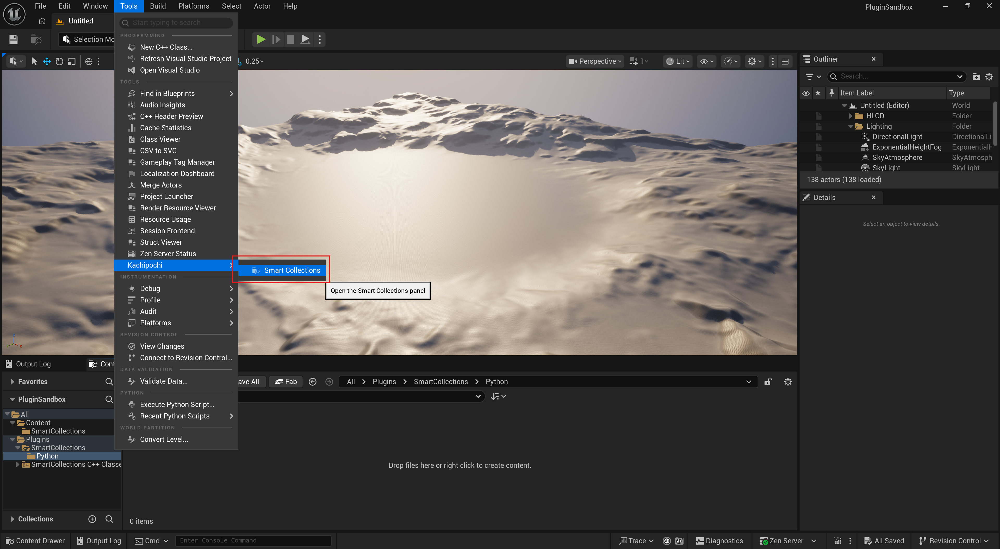
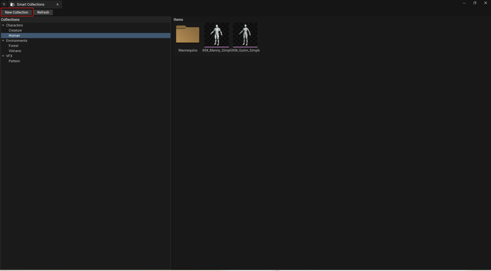
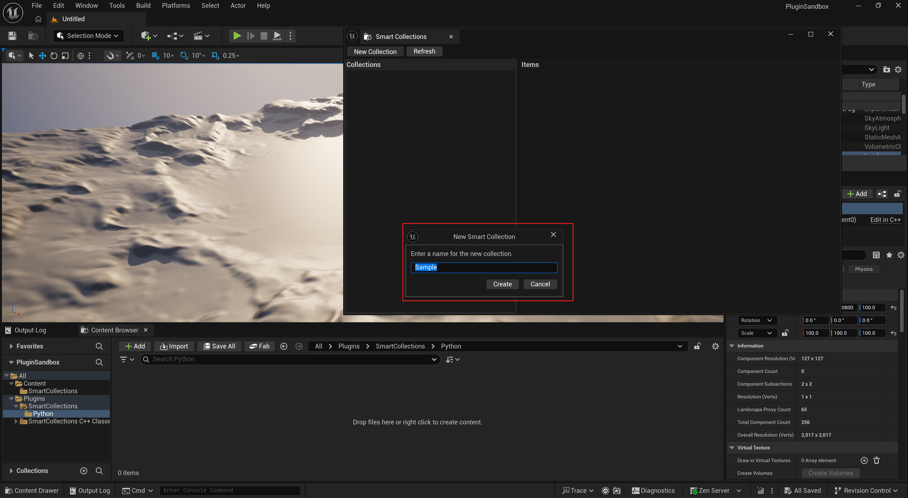
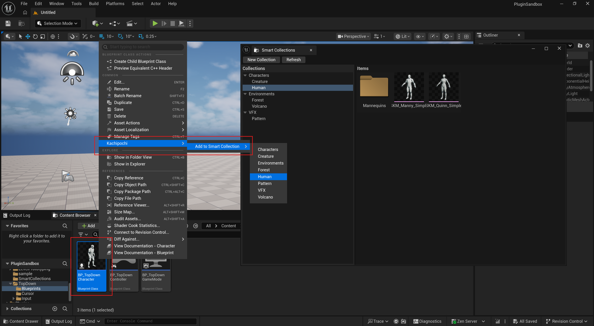

# SmartCollections — Documentation
  

**Publisher:** Kachipochi  
**Supported Engine Versions:** Unreal Engine 5.5, 5.6, 5.7  
**Plugin Type:** Editor Plugin (no runtime component)

---

## Overview

SmartCollections is an Unreal Engine editor plugin that adds a smart, file-based
collection system to the Content Browser. Collections are stored as plain-text
`.smc` files (JSON format) that can be version-controlled alongside your project.

Key features:
- Create and manage named collections directly inside the Content Browser
- Collections persist as `.smc` files — shareable via source control
- Filter assets by collection in the Content Browser panel
- Python scripting interface for automation workflows

---

## Requirements

- Unreal Engine 5.5 or later
- The built-in **ContentBrowserFileDataSource** plugin must be enabled
  (enabled by default in UE 5.5+)

---

## Installation

1. Copy the `SmartCollections` folder into your project's `Plugins/` directory,
   or into the engine's `Plugins/Marketplace/` directory for a global install.
   (If you installed it directly via Fab, you do not need to follow these steps.)
2. Open your project in the Unreal Editor.
3. Go to **Edit → Plugins**, search for **SmartCollections**, and enable it.
4. Restart the editor when prompted.

---

## Usage

  

### Opening the SmartCollections Panel

After enabling the plugin, open the panel via:

**Tools → Kachipochi → SmartCollections**

The panel appears as a dockable tab inside the editor.


  

### Creating a Collection

1. Click the **+** button in the SmartCollections panel.
2. Enter a name for the new collection.
3. A `.smc` file is created in your project's content folder.

  

### Adding Assets to a Collection

1. Select one or more assets in the Content Browser.
2. Right-click → **SmartCollections → Add to Collection → [Collection Name]**.

### Filtering by Collection

Select a collection in the SmartCollections panel to filter the Content Browser
to show only the assets belonging to that collection.

---

## Python Scripting

The plugin exposes a Python interface for automation. Example scripts are
provided in `Content/Python/smart_collections_examples.py`.

```python
import unreal

# List all collections
collections = unreal.SmartCollectionsLibrary.get_all_collections()

# Add an asset to a collection
unreal.SmartCollectionsLibrary.add_asset_to_collection("/Game/MyAsset", "MyCollection")
```

Refer to `Content/Python/smart_collections_examples.py` for full examples.

---

## Support

For questions or bug reports, please contact:  
**Kachipochi** — via the FAB product page support link.
